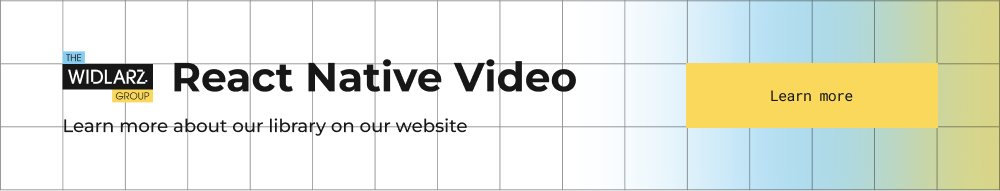

# react-native-video  
*A modern, community-driven video component for React Native*

<a href="https://www.thewidlarzgroup.com/?utm_source=rnv&utm_medium=readme&utm_campaign=enterprise&utm_id=banner">
  <picture>
    <source media="(prefers-color-scheme: dark)" srcset="./docs/assets/baners/twg-dark.png" />
    <source media="(prefers-color-scheme: light)" srcset="./docs/assets/baners/twg-light.png" />
    
  </picture>
</a>

[](https://www.npmjs.com/package/react-native-video)
[](https://github.com/TheWidlarzGroup/react-native-video/actions)
[](https://discord.gg/9WPq6Yx)
[](https://twitter.com/TheWidlarzGroup)

---

## ✨ Project status & roadmap

| Version | State | Notes |
|---------|-------|-------|
| **v5 and lower** | ❌ *EOL* | No new development. Commercial **maintenance & support** available. |
| **v6** | 🛠 *Maintenance* | Community-driven. Accepting PRs. Commercial budget funds ongoing work. |
| **v7** | 🚀 *In active development* | Public release **soon™**. Become a **sponsor** to get early access & influence roadmap. |

> **react-native-video** is a **community-based project** lovingly maintained by **[The Widlarz Group (TWG)](https://thewidlarzgroup.com)** — experts in React Native apps.  
> Your sponsorship accelerates fixes, features, and the next major release. ❤️

---

## �� Why choose *react-native-video*

- �� **Feature-rich** — HLS/DASH, DRM, PiP, adaptive bitrate, subtitles, analytics hooks and more.  
- �� **iOS • Android • tvOS • Windows** — one API, all platforms.  
- ⚡️ **Performant** — hardware decoding wherever possible, configurable buffering.  
- �� **Composable** — headless & render-prop flavours, fits every design system.  
- �� **Battle-tested** — used by thousands of apps, from scrappy MVPs to Fortune 500.

---

## �� Quick start

```bash
# 1 Install
yarn add react-native-video
# 2 Link native deps (RN < 0.60) or autolink (RN ≥ 0.60)
cd ios && pod install
# 3 Use it!
```

```tsx
import Video from 'react-native-video';

export default () => (
  <Video
    source={{ uri: 'https://www.w3schools.com/html/mov_bbb.mp4' }}
    style={{ width: '100%', aspectRatio: 16 / 9 }}
    controls
  />
);
```

<details>
<summary>📚 **Full docs & examples**</summary>

- Installation  
- API reference  
- Events  
- Adaptive streaming  
- DRM (Widevine / FairPlay)  
- Subtitles  
- Buffering strategies  
- Custom UI  
- Troubleshooting  

</details>

---

## �� Roadmap

| Milestone | Status |
|-----------|--------|
| Re-architecture to **TurboModules & JSI** | ✅ done in v7 |
| **Offline Video SDK** integration | 🚧 ongoing |
| React Native 0.74 compatibility | ✅ |
| Expo config plugin | 🔜 |
| tvOS redesign | 🔜 |

---

## �� Commercial add-ons & services

| Product / Service | What you get | How it helps |
|-------------------|--------------|--------------|
| **Issue Booster** | Pay-per-issue prioritisation | Jump the queue, fix blockers fast |
| **Offline Video SDK** <br>_Secure downloads, DRM, asset control_ | DASH & HLS, Widevine/FairPlay, queuing, pause/resume, metadata, expiry | Netflix-grade offline playback in days, not months |
| **Custom development** | Team of senior RN engineers | Features, audits, migrations, performance |

✉️ **Need something special?** Reach out at *contact @thewidlarzgroup.com*

---

## �� Community & media

- �� **RN Video Friday** — weekly newsletter by [@Sebastiandotdev](https://x.com/Sebastiandotdev)  
- �� **React Native NYC** — monthly meetup (talks & demos)  
- �� **Nitro Module v7 deep-dive** — upcoming livestream, stay tuned!  

---

## �� Social & community

| Platform | Link |
|----------|------|
| 🐦 X / Twitter | <https://x.com/TheWidlarzGroup> |
| 💼 LinkedIn | <https://linkedin.com/company/the-widlarz-group> |
| 💬 Discord | <https://discord.gg/9WPq6Yx> |
| 🌐 Web | <https://thewidlarzgroup.com> |

---

## ✍️ Contributing

PRs welcome! Please read the **[contributing guide](CONTRIBUTING.md)** first.  
For larger features, open a discussion / issue to align on direction.

---

## �� License

[MIT](LICENSE) © The Widlarz Group & community contributors